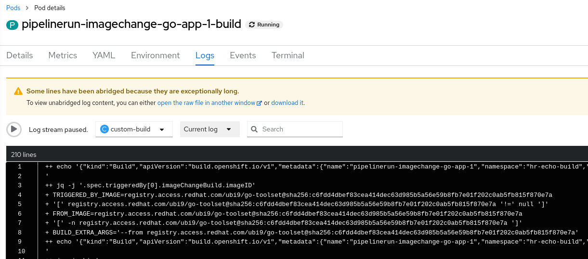
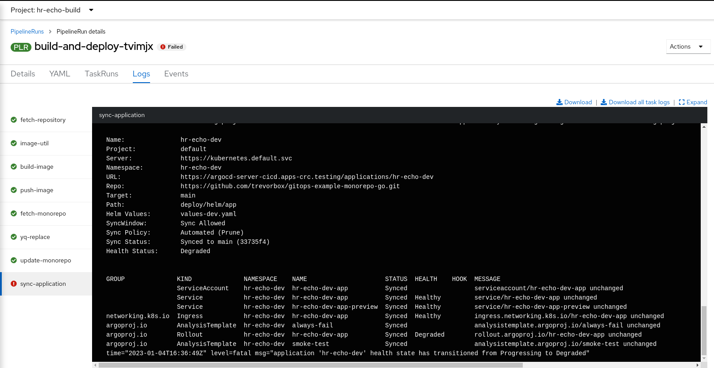

# gitops-example-monorepo-go

An example infrastructure as code (IAC) monorepo to house gitops, pipeline, and deployment source code used to build and deploy an [example go application](https://github.com/trevorbox/s2i/tree/master/go).

## setup

### deploy operators

```sh
helm upgrade -i openshift-pipelines-operator setup/helm/openshift-pipelines-operator/ -n openshift-operators
```

```sh
helm upgrade -i openshift-gitops-operator setup/helm/openshift-gitops-operator/ -n openshift-operators
# delete default controller in openshift-gitops namespace if not needed
oc delete gitopsservice cluster -n openshift-gitops
```

### create namespaces and setup vars

```sh
export argo_namespace=cicd
export envs=( dev build qa perf prod )
export context=echo
export org=hr

for i in "${envs[@]}"; do ns=${org}-${context}-${i} && oc new-project ${ns} && oc label namespace ${ns} argocd.argoproj.io/managed-by=${argo_namespace}; done
```

> Note: there should be a Group created that your User belongs to and defined in the ArgoCD CR's spec.rbac section to allow your user admin access

example ArgoCD CR spec.rbac snippet:

```yaml
  rbac:
    defaultPolicy: ''
    policy: |
      g, cluster-admins, role:admin
    scopes: '[groups]'
```

### deploy argocd

```sh
helm upgrade -i cicd setup/helm/argocd/ -n ${argo_namespace} --create-namespace
```

## deploy rootapp


```sh
# dev cluster rootapp
helm upgrade -i rootapp argocd/helm/rootapp/ -n ${argo_namespace} \
  --set org=${org} \
  --set context=${context} \
  -f argocd/helm/rootapp/values-cluster-dev.yaml
# stage cluster rootapp
helm upgrade -i rootapp argocd/helm/rootapp/ -n ${argo_namespace} \
  --set org=${org} \
  --set context=${context} \
  -f argocd/helm/rootapp/values-cluster-stage.yaml
# prod cluster rootapp
helm upgrade -i rootapp argocd/helm/rootapp/ -n ${argo_namespace} \
  --set org=${org} \
  --set context=${context} \
  -f argocd/helm/rootapp/values-cluster-prod.yaml
```

## deploy build pipeline


```sh
export build_namespace=${org}-${context}-build
```

```sh
podman login quay.io
helm upgrade -i build-and-deploy-go-app-pipeline pipelines/helm/build -n ${build_namespace} \
  --set-file quay.dockerconfigjson=${XDG_RUNTIME_DIR}/containers/auth.json \
  --set-file github.ssh.id_rsa=${HOME}/.ssh/tkn/id_ed25519 \
  --set-file github.ssh.known_hosts=${HOME}/.ssh/known_hosts \
  --set argocd.server=argocd-server.${argo_namespace}.svc.cluster.local \
  --set argocd.username=admin \
  --set argocd.password=$(oc get secret argocd-cluster -n ${argo_namespace} -o jsonpath={.data.admin\\.password} | base64 -d) \
  --create-namespace
```

## build image-util

We need to create our own utilitly image for the pipeline to inspect the next semver from remote registries, use the yq tool to update yaml files in a monorepo and setup variables like base/builder image digest values.

> Note: make the image publicly accessible in quay.io after it is pushed (if needed)

```sh
helm upgrade -i build-image-util image-util/helm/build -n ${build_namespace}
```

## pipelinerun on image change

We can use a BuildConfig to run a custom script baked into a custom image to create PiplelineRuns whenever a builder or base ImageStreamTag (IST) imports new latest images (scheduled every 15 minutes by default).

See [Image Change Triggers for Tekton](https://labs.consol.de/development/kubernetes/openshift/2022/03/14/image-change-triggers-for-tekton.html) for more details on this concept.



### build pipelinerun on image change

> Note: make the image publicly accessible in quay.io after it is pushed (if needed)

```sh
helm upgrade -i build-pipelinerun-imagechange-go-app pipelinerun-imagechange-go-app/helm/build -n ${build_namespace}
```

### deploy pipelinerun on image change

```sh
helm upgrade -i deploy-pipelinerun-imagechange-go-app pipelinerun-imagechange-go-app/helm/deploy -n ${build_namespace}
```

## manually create a pipelinerun

```sh
oc apply -f pipelines/pipelinerun-build-deploy-go-app.yaml -n ${build_namespace}
```

## cleanup

```sh
helm delete build-image-util -n ${build_namespace}
helm delete build-pipelinerun-imagechange-go-app -n ${build_namespace}
helm delete deploy-pipelinerun-imagechange-go-app -n ${build_namespace}
helm delete build-and-deploy-go-app-pipeline -n ${build_namespace}
oc delete -f pipelines/pipelinerun-build-deploy-go-app.yaml -n ${build_namespace}

helm delete rootapp -n ${argo_namespace}
for i in "${envs[@]}"; do ns=${org}-${context}-${i} && oc delete project ${ns}; done
```

## argocd rollouts

### argocd rollouts install

To test out cluster-scoped ArgoCD Rollouts use the following to install ...

```sh
kubectl create namespace argo-rollouts
kubectl apply -n argo-rollouts -f https://github.com/argoproj/argo-rollouts/releases/latest/download/install.yaml
```

### argocd rollouts cli plugin install

See <https://argo-rollouts.readthedocs.io/en/stable/installation/#kubectl-plugin-installation>

### argocd rollouts blue/green test

The deployment chart for the application has an optional flag to use ArgoCD Rollouts instead of Deployments. You will need to commit a change to the desired values file in this monorepo's main branch.

for example...

```sh
[tbox@fedora gitops-example-monorepo-go]$ cat deploy/helm/app/values-dev.yaml 
image:
  repository: quay.io/trevorbox/go-app
  # Overrides the image tag whose default is the chart appVersion.
  tag: "v0.1.0-15"
useArgoRollout: true
```

The Rollout uses a blue/green strategy and runs a smoke-test k8s Job before before allowing the switch-over, if successful.

example successful rollout after pipeline rebuild...

```sh
[tbox@fedora gitops-example-monorepo-go]$ kubectl argo rollouts get rollouts hr-echo-dev-app -n hr-echo-dev
Name:            hr-echo-dev-app
Namespace:       hr-echo-dev
Status:          ✔ Healthy
Strategy:        BlueGreen
Images:          quay.io/trevorbox/go-app:v0.1.0-16 (stable, active)
Replicas:
  Desired:       1
  Current:       1
  Updated:       1
  Ready:         1
  Available:     1

NAME                                                          KIND         STATUS        AGE  INFO
⟳ hr-echo-dev-app                                             Rollout      ✔ Healthy     20m  
├──# revision:2                                                                               
│  ├──⧉ hr-echo-dev-app-744cf678c8                            ReplicaSet   ✔ Healthy     12m  stable,active
│  │  └──□ hr-echo-dev-app-744cf678c8-6rz5w                   Pod          ✔ Running     12m  ready:1/1
│  └──α hr-echo-dev-app-744cf678c8-2-pre                      AnalysisRun  ✔ Successful  12m  ✔ 1
│     └──⊞ 2a985827-17b3-4c11-a828-791c99fa67cf.smoke-test.1  Job          ✔ Successful  12m  
└──# revision:1                                                                               
   └──⧉ hr-echo-dev-app-545566945c                            ReplicaSet   • ScaledDown  20m 
```

example failure (AnalysisRun Job failure)...

```sh
[tbox@fedora gitops-example-monorepo-go]$ kubectl argo rollouts get rollouts hr-echo-dev-app -n hr-echo-dev
Name:            hr-echo-dev-app
Namespace:       hr-echo-dev
Status:          ✖ Degraded
Message:         RolloutAborted: Rollout aborted update to revision 3: Metric "always-fail" assessed Failed due to failed (1) > failureLimit (0)
Strategy:        BlueGreen
Images:          quay.io/trevorbox/go-app:v0.1.0-16 (stable, active)
Replicas:
  Desired:       1
  Current:       1
  Updated:       0
  Ready:         1
  Available:     1

NAME                                                           KIND         STATUS        AGE  INFO
⟳ hr-echo-dev-app                                              Rollout      ✖ Degraded    47m  
├──# revision:3                                                                                
│  ├──⧉ hr-echo-dev-app-7fdc57b8cf                             ReplicaSet   • ScaledDown  20m  preview,delay:passed
│  └──α hr-echo-dev-app-7fdc57b8cf-3-pre                       AnalysisRun  ✖ Failed      19m  ✖ 1
│     └──⊞ 9f20f627-4970-4567-9f7d-5a99df04f009.always-fail.1  Job          ✖ Failed      19m  
├──# revision:2                                                                                
│  ├──⧉ hr-echo-dev-app-744cf678c8                             ReplicaSet   ✔ Healthy     39m  stable,active
│  │  └──□ hr-echo-dev-app-744cf678c8-6rz5w                    Pod          ✔ Running     39m  ready:1/1
│  └──α hr-echo-dev-app-744cf678c8-2-pre                       AnalysisRun  ✔ Successful  39m  ✔ 1
│     └──⊞ 2a985827-17b3-4c11-a828-791c99fa67cf.smoke-test.1   Job          ✔ Successful  39m  
└──# revision:1                                                                                
   └──⧉ hr-echo-dev-app-545566945c                             ReplicaSet   • ScaledDown  47m  
```

The sync step in the pipeline also fails due to degraded Rollout...


